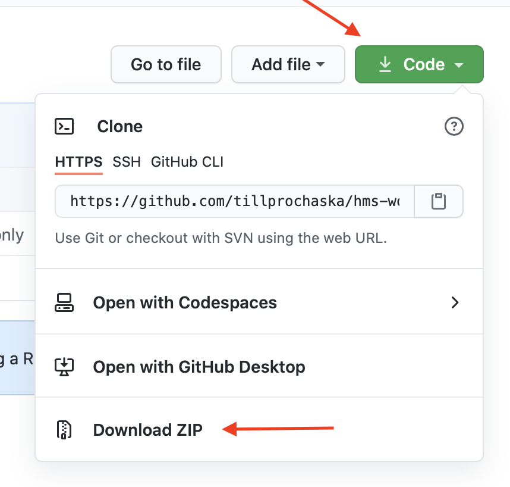

# Die Wuddy-Chrome-Erweiterung

So bekommt ihr die Erweiterung in eueren Browser:

#### 1. Erweiterung herunterladen

Öffnet [dieses Projekt bei GitHub](https://github.com/tillprochaska/hms-workshop-chrome-to-adafruit) und ladet die Erweiterung als ZIP-Archiv herunter und entpackt sie.

#### 2. Entwickler-Modus in Chrome aktivieren

1. Gebt diese Adresse ins Adressfeld ein: `chrome://extensions/`
2. Aktiviert rechts oben den Schalter "Developer Mode".

#### 3. Erweiterung laden

Klickt auf den Button "Load unpacked" und wählt den (entpackten) Ordner aus, den ihr im ersten Schritt heruntergeladen habt.

